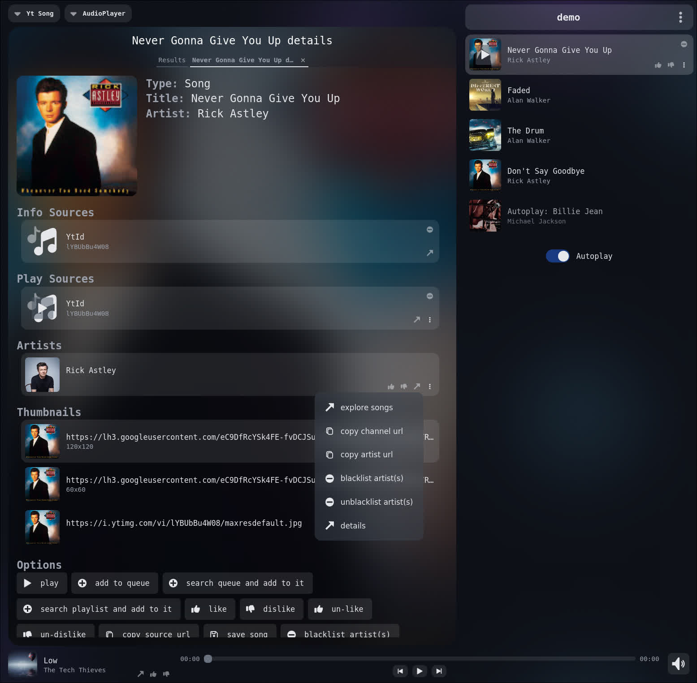
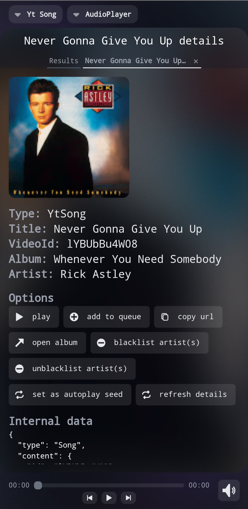

# Covau!. Come Vibe Amongst Us
Welcome to Covau! Covau is a music app that lets you keep your playlists on your own device. Instead of relying on the cloud, you can store your lists locally and stream music from various sources. If a song disappears, just switch to a new source!

# [Covau webapp](https://github.com/thrombe/covau)
This project is a continuation of a previous web app I developed, designed to let you listen to music or watch YouTube videos with friends. Covau synchronizes the music across all connected devices, so you can enjoy a seamless experience together.

# Desktop App

# Android App

# Features
- Browse YouTube
- Explore the MusicBrainz catalog
- Automatically search and play MusicBrainz songs from YouTube
- Stream YouTube videos and music
- Autoplay: Keep discovering new songs similar to what's in your queue
  - Blacklist artists you don’t want to hear from
  - Set a seed song for autoplay
  - No repeats. enjoy new songs when in autoplay.
- Multiple queues
  - Useful if you listen to multiple playlists and move between them accoring to your mood on the day
  - Keep your music genres in separate queues.
  - Autoplay suggests from currently playing queue.
- Save music for offline listening
- Cli interface to interact with the app
  - useful for scripting and for keybinds to interact with the app

# How Covau Works
Covau uses web technologies for its user interface, built with Svelte and TypeScript. It has a localhost server written in Rust, allowing you to access the app from a webview window or your browser.
- Windows: Utilizes [tao](https://github.com/tauri-apps/tao) and [wry](https://github.com/tauri-apps/wry) to open a webview, similar to [tauri](https://github.com/tauri-apps/tauri).
- Linux: Runs on Qt WebEngine, which performs better than webkit2gtk which tauri uses on linux.
- Android: Leverages Android's webview and wraps the Covau server in a native Kotlin app for a smoother experience.

# Future Work
- Get automatic updates when your favorite artists release new songs
- More control over autoplay settings
  - option to play only from a selected group of artists
- More convenience features
- [Covau webapp](https://github.com/thrombe/covau) compatibility

# Naming
In the spirit of Microsoft naming everything "Copilot," I’ve decided to call both the web app and the desktop/Android apps "Covau," even though they serve different purposes. 

Thanks for checking out Covau! Feel free to dive in and enjoy your music your way!
